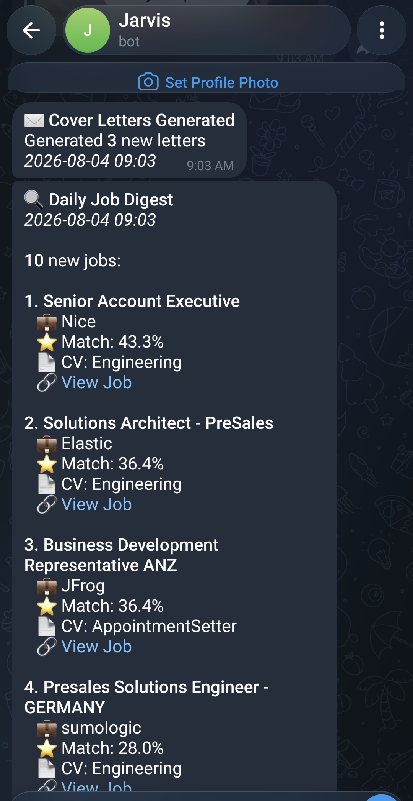

# Job Intelligence Agent

Reads company careers pages and job boards every morning, scores what it finds against my CV, and sends the handful worth reading to Telegram.

---

## Pipeline

```
SOURCES
  Company careers pages   Greenhouse, Lever, Ashby, SmartRecruiters, Workday
                          Read directly from each employer's own board.
                          No key, no quota, full job descriptions.
  Aggregators             RemoteOK, Remotive, Arbeitnow, The Muse, Jobicy,
                          WeWorkRemotely, Himalayas, Adzuna, Jooble
  LinkedIn                Public guest endpoint, no authentication
  JSearch                 RapidAPI, metered
  Apify                   LinkedIn and Indeed with full text, metered
  SerpAPI                 Google Jobs, needs a key
  DuckDuckGo              Scrapes public job board pages
  Gmail drafts            Jobs I saved by hand
      |
      |  every source is timed, counted, and recorded, and one failure
      |  cannot end the run
      v
DEDUPLICATE
  Canonical URL           30 tracking parameters stripped
  Normalised key          "Sales Engineer (Remote, m/w/d)" at "Acme B.V."
                          and "Sales Engineer" at "Acme" are one job
  Near-duplicate pass     Jaccard similarity on title tokens, same company
      |
      v
ENRICH
  Some boards return a title and no description. Scoring those measures
  how much text the source returned, not how well the job fits. A cheap
  title screen decides which are worth a second request, then the full
  description is fetched for those only.
      |
      v
SCORE
  Each job is scored against every CV separately. Best CV wins and is
  recorded. Multipliers for a target role in the title and for an
  industrial or B2B sector match.
      |
      v
FILTER
  Dealbreaker keywords, geography restrictions, non-English titles,
  minimum score. Every rejection is counted by reason and reported.
      |
      v
STORE
  SQLite. Unique on the normalised key, so a repeat increments a counter
  instead of creating a row.
      |
      v
DELIVER
  Telegram, 15 a day: 5 from company boards, 5 from aggregators,
  5 wildcard, at most 2 per employer. Every slot is score-gated.
  Cover letters for the top matches through the Claude API.
      |
      v
TRACK
  A second inbox is scanned for application confirmations and rejections.
  A local dashboard shows the pipeline. A weekly digest reports per-source
  yield and names any source that has gone quiet.
```

---

## Why it exists

I was applying to jobs by hand and losing good listings to the volume of bad ones. The interesting part turned out to be everything except the searching: deduplicating the same job arriving from five places, telling a real match from a keyword-stuffed one, and noticing when a source has quietly stopped returning anything.

---

## What it actually does

Only what is in the code.

**Reads employer careers pages directly.** Five applicant tracking systems: Greenhouse, Lever, Ashby, SmartRecruiters and Workday. You list the companies you want in a config file and it checks their real careers pages daily. No API key, no quota, and the posting is the company's own rather than an aggregator's copy of it.

**Survives a dead source.** Every source runs inside a wrapper that times it, catches whatever it throws, and records the outcome. One source failing cannot end the run.

**Retries transient failures.** 408, 429, 500, 502, 503, 504 and connection errors, with exponential backoff, and it obeys a `Retry-After` header when the server sends one. 401, 403 and 404 are deliberately not retried, because repeating a request the server already rejected wastes quota.

**Reports its own health.** Each run prints a per-source table and writes it to the database. It warns when one source produces more than 90 percent of results, and names any source that has returned nothing for three consecutive runs, with how many days it has been quiet and its last error. A source that recovers is reported too, because several are free monthly tiers that reset on their own.

**Deduplicates on normalised values.** URLs lose their tracking parameters. Titles lose `(Remote)`, `(m/w/d)`, employment type and trailing locations. Companies lose `Inc`, `GmbH`, `B.V.`, `d.o.o.` and about thirty other legal suffixes. Seniority is deliberately preserved: Senior Sales Engineer and Sales Engineer stay two jobs, and there is a test enforcing it.

**Scores per CV, not once.** For each CV it counts how many of that CV's skills appear in the job text, divided by a denominator capped at 15, because a job description will never mention all fifty. The best-scoring CV is stored with the job so the digest can say which one to send.

**Composes a digest by quota.** Guaranteed slots for company boards, aggregators and wildcard, capped at two per employer. A quota is a ceiling and never a floor: if only two board jobs clear the score bar, you get two, and the run says why the rest went unfilled.

**Generates cover letters** through the Claude API for the top matches, and saves them as DOCX.

**Tracks applications** by scanning a second inbox for confirmation and rejection emails, matching them back to stored jobs.

### What it does not do

- No web UI beyond a local Flask dashboard.
- No proxy rotation or CAPTCHA handling. A source that blocks scraping stays blocked.
- Scoring is keyword matching with multipliers. There are no embeddings and no semantic similarity.
- Deduplication is normalised string matching, not fuzzy across companies. The same job at two subsidiaries with different legal names will appear twice.
- Cover letters are generated, not sent. Nothing is submitted on your behalf.

---

## What went wrong: the validator that threw away 86 percent of the results

For weeks the daily digest was thin. Not empty, just consistently smaller than the number of jobs the sources were returning, and I put it down to a quiet market.

Before scoring, every listing went through a validator that checked whether the posting was still live. It made a request, lowercased the page body, and searched for phrases that appear when a listing has been taken down. The list was reasonable at first glance:

```python
EXPIRED_PHRASES = [
    'no longer available', 'position has been filled',
    'this job has expired', 'no longer accepting',
    'page not found', 'sorry, this job', '404', 'does not exist',
]
```

The last four are the problem, and `'404'` is the worst of them.

That check is a bare substring search against the entire HTML of the page. A live job listing contains `404` constantly. It appears in build hashes:

```html
<link rel="stylesheet" href="/static/css/app.404abc12.css">
```

In inline error handlers:

```html
<script>
  window.onError = function (code) {
    if (code === 404) { location = '/page-not-found'; }
  };
</script>
```

In analytics payloads, in asset filenames, in route tables. `'page not found'` and `'does not exist'` are almost as bad, for the same reason: they show up in client-side code on pages that are serving a perfectly good listing.

So the validator was rejecting live jobs. Not occasionally, constantly.

**Why it took weeks to see.** Every rejection was logged at `DEBUG`, and the log level was `INFO`. Nothing was written when a job was discarded. The only line that survived was the summary:

```
Validated 27 active jobs from 200 total
```

That line was in the logs the whole time. It reads as a normal filter doing normal work, and I never looked at the ratio. There was no error, nothing crashed, and the digest still arrived every morning with jobs in it. The system was not broken in any way it could tell me about. It was just quietly wrong.

I found it by accident, reading old logs for something else, and noticing the same shape repeating:

```
Validated 24 active jobs from 217 total     11 percent
Validated 27 active jobs from 200 total     14 percent
Validated 30 active jobs from 233 total     13 percent
Validated 29 active jobs from 162 total     18 percent
```

**The immediate fix** was one argument: link checking was turned off, which restored the results at the cost of occasionally showing a dead listing. That was the right trade, and it is still the default.

**The real fix** was removing the four loose phrases and writing tests that stop them coming back. There is now a test asserting that `'404'`, `'page not found'` and `'does not exist'` are not in the list, and another that builds a realistic live page containing `app.404abc12.css` and an inline `if(c===404)` handler and asserts it matches no expiry phrase. A third asserts that 100 fresh jobs survive validation whole, so a future regression trips a test instead of quietly shrinking the digest.

**What I took from it.** The bug was one string in a list. What made it expensive was that discarding was silent. Every filter in the pipeline now counts what it rejected and why, and reports it:

```
Filtered 46 of 125 jobs (79 rejected: geo_restricted=12, below_min_score=67)
```

If that line had existed, this would have been a five minute problem.

---

## Stack

Python 3.11 or newer, no framework.

| | |
|---|---|
| HTTP | `requests` with a `urllib3` retry adapter |
| Parsing | `beautifulsoup4`, `pdfplumber` for CVs |
| Storage | SQLite, WAL mode, standard library `sqlite3` |
| Generation | Anthropic Claude API |
| Delivery | Telegram Bot API, Gmail over IMAP and SMTP |
| Dashboard | Flask |
| Tests | pytest |
| Normalisation | standard library only, `re` and `urllib.parse` |

190 tests, covering scoring, filtering, deduplication, storage, source health, digest composition, retry policy and three regressions that each cost real results. Every test runs against fixtures and temporary files. No test touches a real database or makes a network call.

The connectors have tests now. Not by mocking ten third-party APIs, which is a larger job than this project justifies, but by capturing one real response per source, trimming it to two jobs, and asserting on the record the parser produces. That covers the half of a connector that breaks silently: the mapping from somebody else's JSON shape into ours.

They were written because three bugs were found in that layer by hand, all with the same shape. The Jobicy connector sent a geo value the API rejects, so it answered 400 to every request and returned nothing on every run. The Muse fetched an unfiltered feed and discarded 99 percent of it in Python. And the Greenhouse description parser unescaped HTML after stripping tags instead of before, so every Greenhouse description arrived full of markup and fed tag names and data attributes straight into keyword scoring.

The third one was found by these tests, on their first run.

What they do not cover is the network. The fixtures go stale if a provider changes their schema, and green tests here are not evidence of a live system.

---

## Setup

**1. Clone and install.**

```bash
git clone https://github.com/wule15/Job-intelligence-agent.git
cd job-intelligence-agent
python -m venv .venv
source .venv/bin/activate      # Windows: .venv\Scripts\activate
pip install -r requirements.txt
```

**2. Configure credentials.**

```bash
cp .env.example .env
```

Fill in `.env`. Only three blocks are required:

- **Gmail**, for reading saved job links. Needs an app password, not your account password. Google Account, Security, 2-Step Verification, App passwords.
- **Telegram**, for the digest. Create a bot with [@BotFather](https://t.me/botfather) for the token, message it once, then run `python get_chat_id.py` for the chat id.
- **Anthropic**, for cover letters. [console.anthropic.com](https://console.anthropic.com/)

Every job board key is optional. A missing key disables that one source and the run continues.

**3. Choose the companies you want to work for.**

```bash
cp config/companies.example.json config/companies.json
```

Edit it. This is the highest-value part of the setup, and the example file explains how to find a company's board. You read it off their careers page URL:

```
boards.greenhouse.io/SLUG          ->  "ats": "greenhouse", "slug": "SLUG"
jobs.lever.co/SLUG                 ->  "ats": "lever"
jobs.ashbyhq.com/SLUG              ->  "ats": "ashby"
jobs.smartrecruiters.com/SLUG      ->  "ats": "smartrecruiters"
TENANT.wdN.myworkdayjobs.com/SITE  ->  "ats": "workday", plus "wd" and "site"
```

Verify a slug before trusting it. Searching the web for a company's Workday URL turns up plenty of live boards belonging to somebody else, and a wrong tenant returns 200 with thousands of jobs that look completely normal until you read them.

**4. Add your CVs.**

Put them in `resumes/` as PDFs. Skills are extracted from them on first run and refreshed weekly. This directory is gitignored.

**5. Check it works.**

```bash
python validate_system.py     # configuration and connectivity
pytest                        # 190 tests, no network
python job_search_smart.py    # one real run
```

A run prints a per-source table. If one source is producing everything, that is worth knowing on day one.

**6. Schedule it.**

There is no scheduler inside the application. Use whatever your operating system provides.

```bash
# Linux or macOS, crontab -e
0 9 * * * cd /path/to/job-intelligence-agent && .venv/bin/python job_search_smart.py
5 9 * * * cd /path/to/job-intelligence-agent && .venv/bin/python telegram_sender.py
```

On Windows, use Task Scheduler pointed at the same two commands.

Those two commands are the whole scheduled pipeline. `job_search_smart.py`
searches every source, deduplicates, scores and stores. `telegram_sender.py`
composes the digest from what is stored and sends it.

**7. Optional, cover letters by hand.**

```bash
python write_cover_letters.py              # stored jobs with no letter yet
python write_cover_letters.py --search     # search first, then use the results
python write_cover_letters.py --limit 5    # default is 3
```

Drafts DOCX cover letters through the Claude API. This is a manual path, not
part of the scheduled run, and it sends nothing. Letters land in `output/`,
which is gitignored, and you review them before they go anywhere.

The default reads what the scheduled run already stored and skips any job that
already has a letter, so running it twice does not pay for the same letter
twice. Each letter is one API call, which is why the count is capped.

**8. Optional dashboard.**

```bash
python dashboard.py           # http://localhost:5000
```

---

## The daily digest



Fifteen a day, capped at two per employer, each one carrying the score and which CV scored it.

The percentages are a ranking device, not a probability. A score is the count of that CV's skill terms appearing in the job text over a denominator capped at 15, so 43 percent means roughly six or seven terms matched, not that the job is a 43 percent fit. It exists to order the list and to fill the quota, and the known weaknesses section below is honest about what it cannot see.

---

## Known weaknesses

The three I would raise first if you were reviewing this.

**The connector tests are fixture based, so they will go stale.** They pin the parser against a response captured on one day. If a provider changes their JSON shape the tests keep passing and the connector quietly stops working, which is the exact failure they were written to catch. They need re-capturing periodically and nothing currently reminds anyone to do it.

**Deduplication is normalisation, not understanding.** It handles decorated titles and legal suffixes well. It cannot tell that two differently named subsidiaries of the same group are one employer, and it will not catch a job reposted with a genuinely different title.

**Scoring is keyword counting.** Skill terms are matched with a synonym map and boosted by role and sector. It has no notion of meaning, so a job description that lists technologies without requiring them scores the same as one that does.

---

## Licence

MIT. See [LICENSE](LICENSE).
