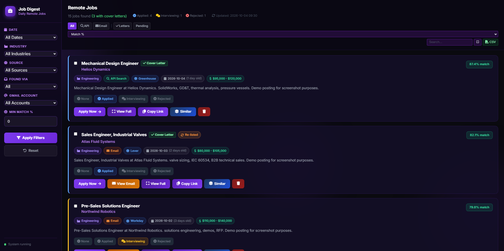
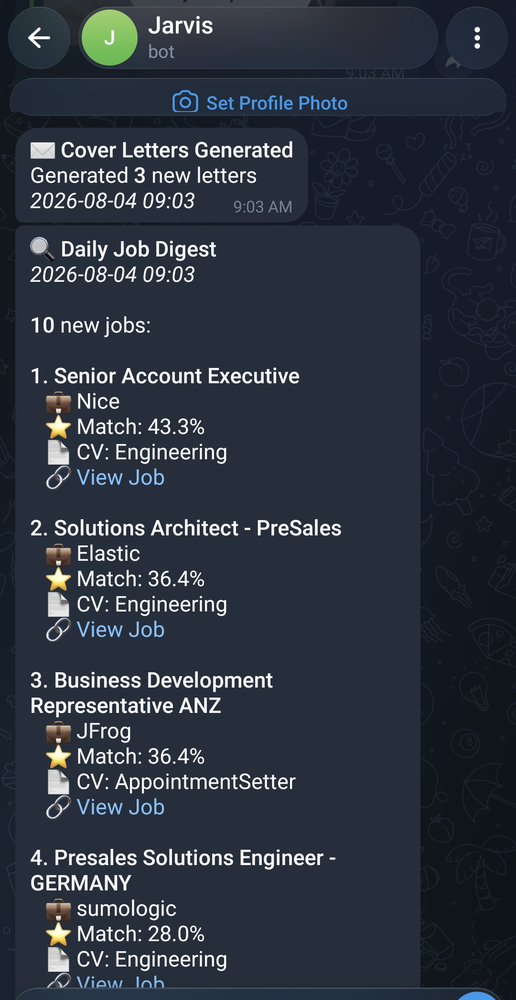

# Job Intelligence Agent

Reads company careers pages and job boards, scores each job against every CV variant in `master-cv.yaml`, and sends the ones that clear a score bar to Telegram. Each run does one pass and exits, so the daily schedule comes from cron, Task Scheduler or a container.

---

## Quick start

The full [Setup](#setup) section explains every option. This is the shortest
path that works.

```bash
git clone https://github.com/wule15/Job-intelligence-agent.git
cd Job-intelligence-agent
python -m venv .venv && source .venv/bin/activate   # Windows: .venv\Scripts\activate
pip install -r requirements.txt

cp .env.example core/.env                            # add the Telegram bot token and chat id
mkdir -p core/config
cp config/companies.example.json core/config/companies.json
cp master-cv.example.yaml core/master-cv.yaml        # list your skills, one block per CV variant

python job_search_smart.py                           # one real run: search, score, store
python telegram_sender.py                            # send the Telegram digest from what is stored
python dashboard.py                                  # optional, browse results at localhost:5000
```

Every path sits under `core/`, because `core/config.py` resolves everything
relative to itself. A `.env` or `companies.json` at the repo root is never
read, and a root `master-cv.yaml` only if `MASTER_CV_PATH` points at it.

The two files that decide how well it works are `core/config/companies.json`
(the employers whose boards it reads) and `core/master-cv.yaml` (the skills it
scores against). The CV file is required: without it the run builds no search
queries and every job scores 0. The company list is optional, but it feeds the
best source. Every job-board key is optional: without it that source returns
nothing and the run continues. Telegram needs both the bot token and the chat
id, with no default; without them the search runs but no digest is sent. All
three files are gitignored and stay on your machine.

---

## Pipeline

```
SOURCES
  Company careers pages   Greenhouse, Lever, Ashby, SmartRecruiters, Workday,
                          SuccessFactors. Read directly from each employer's
                          own board, no key. Four return full descriptions.
                          SmartRecruiters and Workday return titles, and the
                          enrich step fetches the text for titles worth reading.
  Aggregators             RemoteOK, Remotive, Arbeitnow, The Muse, Jobicy,
                          WeWorkRemotely, Himalayas, Bundesagentur (German
                          Federal Employment Agency), Adzuna, Jooble and Reed
                          (the last three need a free key), plus an optional
                          local board switched on with REGIONAL_BOARDS
  LinkedIn                Public guest endpoint, no authentication
  JSearch                 RapidAPI, metered, capped by JSEARCH_BUDGET
                          (40 queries a run by default)
  Apify                   LinkedIn with full text, plus Indeed listings
                          without full text, metered
  SerpAPI                 Google Jobs, needs a key, capped by SERPAPI_BUDGET
  DuckDuckGo              Site-restricted web searches of Indeed, LinkedIn,
                          Glassdoor and Wellfound. Reads the result titles
                          and snippets, not the pages
  Gmail drafts            Jobs I saved by hand
      |
      |  each source group except Gmail drafts is timed, counted and
      |  recorded, and an exception in one cannot end the run
      v
DEDUPLICATE
  Canonical URL           34 tracking parameters stripped, host lowercased,
                          fragment and trailing slash dropped. A link stored
                          on an earlier run is skipped
  Normalised key          "Sales Engineer (Remote, m/w/d)" at "Acme B.V."
                          and "Sales Engineer" at "Acme" are one job
  Near-duplicate pass     Jaccard similarity on title tokens, same company
  Age                     A posting date older than 14 days drops the job.
                          A job with no date is kept
      |
      v
ENRICH
  Some boards return a title and no description. Scoring those measures
  how much text the source returned, not how well the job fits. A cheap
  title screen decides which are worth a second request, then the full
  description is fetched for those only. The screen skips titles the title
  rules will drop and jobs located only in countries you cannot work in.
  It also accepts local-language role words listed in TITLE_SCREEN_TERMS,
  matched without diacritics. The local board returns only a short teaser,
  so its adverts are fetched first, under their own budget of 100 fetches
  and 60 seconds, and a busy day on the company boards cannot leave them
  scored on a teaser. The company boards get 60 fetches and 90 seconds.
  Free-board text is kept as plain text up to 8000 characters, since
  adverts list their requirements last. A SuccessFactors job whose feed
  location is the placeholder "City-State-Country" gets its place from
  the advert page (at most 60 pages and 30 seconds).
      |
      v
FILTER
  Hard rules, cheapest first. A job that breaks one is dropped before it
  is scored. Hand-saved jobs skip every rule except the first.
    Scam boards       known fake boards and free-hosting apply links
    Titles            senior titles (Senior, Lead, Staff, Principal, Head
                      of, Director, VP, Chief, and Major, Strategic or
                      Enterprise Account Executive; Manager and Key Account
                      Manager are kept), software
                      titles, and two optional private lists: job functions
                      (EXCLUDED_TITLE_TERMS, e.g. HR, payroll, marketing)
                      and trade titles (DROP_LOCAL_TRADE_TITLES: technician,
                      electrician, local civil engineering)
    Dealbreakers      keywords such as "on-site only" or "must relocate",
                      and security clearance or vetting
    Export control    ITAR, EAR and "US person" roles
    Eligibility       visa sponsorship, citizenship and work-authorization
                      lines, read against WORK_ELIGIBLE_REGIONS and
                      SPONSORSHIP_ONLY_COUNTRIES
    Location          optional EXCLUDED_LOCATIONS, then an optional country
                      allow-list (ALLOWED_COUNTRIES)
    Language          non-English titles, then an optional required-language
                      check (NON_FLUENT_LANGUAGES), then an optional check on
                      the language the advert is written in
                      (UNREADABLE_ADVERT_LANGUAGES)
    Requirements      optional required-years gate (MAX_REQUIRED_YEARS) and
                      optional electrical-only degree rule
                      (DROP_ELECTRICAL_ONLY_DEGREE)
  The years gate drops an advert that requires more years than the limit.
  A range counts as its lower bound, an upper limit ("up to 5 years") is
  not a requirement, and years marked preferred or a plus in the same
  clause do not drop. When one sentence offers a route within the limit
  joined by "or", the lower route decides. The degree rule drops an advert
  whose degree line names electrical or electronics engineering. It keeps
  the advert when a mechanical engineer is named anywhere in it, when a
  sentence that names a degree also names a second discipline or a generic
  alternative ("or a related field", "or Computer Science"), or when the
  electrical degree is only preferred. An advert published with its
  template unfilled (two or more brackets such as "[Jobtitel]" or "[Task #1,
  max. 5 bullet points]", or "lorem ipsum") is dropped, because its
  requirements cannot be read.
  Software titles (including data, machine-learning, cloud and security
  engineering) are dropped on every source, except titles that name QA or
  testing, industrial control programming (PLC, SCADA, HMI, DCS, CNC,
  robotics), vehicle or powertrain work, CFD, CAE, FEA or simulation, or AI
  integration and implementation work. Entry-level software titles from the
  local board are also kept, and lifted to the regional score bar.
  The allow-list reads the location field. A location that names no country
  is left to the text rules, and a remote job whose advert says it is open
  worldwide is kept. A remote or "Anywhere" job that names the one country
  it is remote in ("United States - Remote", or a link ending
  "-united-states-remote") is judged by that country. The required-language
  check drops an advert that asks for a listed language fluent or at C1
  (or, in German, "sichere" or better), and keeps B1, B2 and "a plus". The
  advert-language check reads the advert's common words and drops one
  clearly written in a language you list; a teaser, a mixed advert, one in
  Cyrillic or one that names English as the working language is never
  dropped. The first check reads one sentence at a time and the second
  counts common words, and either can misread an advert.
  Every rejection is counted by reason and logged in one line.
      |
      v
SCORE
  Each job is scored against every CV separately. Best CV wins and is
  recorded. A target role in the title and an industrial or B2B sector word
  lift the score toward 100. Location, remote, sponsorship, experience,
  source and flow-equipment multipliers then move it. Softer scam signals
  (apply by WhatsApp, pay-to-work fees) push it far down and flag the job,
  so the digest warns before you apply. A Serbian or German advert gains
  the English equivalents of the terms it uses, from a small glossary, so
  it is scored on meaning rather than on how much English it contains.
  A job scoring under 10 before the multipliers is not stored, except
  hand-saved jobs and entry-level software from the local board. Of the
  jobs left, two at one company whose adverts print the same posting
  number ("Job ID 12345") are one job, which catches a posting published
  in two languages. The higher-scored copy is kept, and a hand-saved job
  is never dropped this way.
      |
      v
STORE
  SQLite. Unique on the normalised key, so a repeat increments a counter
  instead of creating a row. Rows are deleted after a week unless they have
  a cover letter. A separate send history, which the cleanup never touches,
  records every job that reached the chat.
      |
      v
DELIVER (telegram_sender.py)
  Before any job is chosen, three kinds are held back: a job whose link was
  ever sent, or whose title and company were sent in the last 45 days in
  the same country; a job on the optional DIGEST_EXCLUDE_FILE list, for
  jobs already applied to outside the digest; and a stored job that breaks
  today's hard rules, since the rules can change after a job is stored.
  Then up to three Telegram messages, in this order. A job goes in one only.
    Direct company openings   company boards only, up to 10
    Regional                  jobs whose location names a REGIONAL_MATCH_TERMS
                              term as a whole word, accents ignored, up to 15,
                              with its own bar, REGIONAL_MIN_SCORE
    Main digest               up to 10. Hand-saved jobs first, with no score
                              bar. Then company boards and quality
                              aggregators compete on score. Indeed, JSearch
                              and WeWorkRemotely only fill slots still empty
  At most 2 jobs per employer in each message, hand-saved jobs aside. Every
  other slot must clear its message's score bar: DIGEST_MIN_SCORE (default
  15) for the main and direct messages, REGIONAL_MIN_SCORE (default the
  same) for the regional one. A thin day sends fewer jobs, and a day when no
  message has a job sends one short note naming the bars.
  Before a job is sent its posting is checked, unless it was saved by hand:
  company-board jobs against the vendor's API (Greenhouse, Lever, Ashby,
  SmartRecruiters, Workday), everything else, SuccessFactors included, by
  loading the page. The page is also the fallback when a vendor's API
  cannot tell. A job the vendor reports closed is dropped and its row
  deleted; a page that only reads as closed is skipped that day and checked
  again the next.
  A timeout or error lets it through, and after 60 checks or 90 seconds the
  rest go out unchecked. Each chosen job is logged with its score and full
  link, as "[main] id=N | score=S | title | company | link". A source group
  whose search raised an error in the latest run, or that returned nothing
  for three runs in a row, is named at the end of the digest.
      |
      v
TRACK
  A local dashboard shows what was stored. Two scripts run by hand, outside
  the schedule: gmail_application_tracker.py marks stored jobs applied or
  rejected from confirmation emails, and weekly_digest.py sends a summary of
  the last 7 days, on Mondays only.
```

---

## Why it exists

I was applying to jobs by hand and losing good listings to the volume of bad ones. The interesting part turned out to be everything except the searching: deduplicating the same job arriving from several sources, telling a real match from a keyword-stuffed one, and noticing when a source has quietly stopped returning anything.

---

## What it actually does

Only what is in the code.

**Reads employer careers pages directly.** Six applicant tracking systems: Greenhouse, Lever, Ashby, SmartRecruiters, Workday and SuccessFactors. You list the companies you want in a config file and it reads each board through the vendor's public endpoint on every run. No API key, no quota, and the posting is the company's own rather than an aggregator's copy of it. SuccessFactors has no open JSON API, so that adapter reads the public Google Jobs RSS feed a Career Site Builder site publishes at `HOST/sitemap.xml`.

**Survives a dead source.** Each of the seven search sources (company boards, JSearch, the free aggregators as one group, LinkedIn, SerpAPI, Apify, DuckDuckGo) runs inside a wrapper that times it, catches any exception and records the outcome. The Gmail drafts reader has its own error handling and is not timed or recorded. Most adapters also catch their own request errors, so the wrapper usually records a failure as an empty result, not an error.

**Retries transient failures, where it can.** A shared session (`core/http_client.py`) retries 408, 429, 500, 502, 503, 504 and connection errors with exponential backoff, and obeys a `Retry-After` header. 401, 403 and 404 are deliberately not retried, because repeating a request the server already rejected wastes quota. That session covers the company-board list fetches and the LinkedIn guest endpoint only. JSearch, SerpAPI, the free aggregators, Apify, DuckDuckGo, the per-job detail fetches and the Telegram send do not retry.

**Reports its own health.** Each run prints a per-source table and writes it to the database. It warns when one source produces 90 percent or more of the results, and names any source that has returned nothing for three runs in a row, with how many days it has been quiet and its last error. A source that recovers is reported too, because several are free monthly tiers that reset on their own. The digest names a source group whose search call raised an error in the latest run, or that has been empty for three runs, with every URL stripped from the error text because a request error can carry an API key. Request errors an adapter catches itself (a failed board, a JSearch 429) appear only in the log until the source has been empty for three runs.

**Deduplicates on normalised values.** URLs lose their tracking parameters. Titles lose `(Remote)`, `(m/w/d)`, employment type and trailing locations. Companies lose `Inc`, `GmbH`, `B.V.`, `d.o.o.` and about forty other suffixes and words such as Group and Holding. Seniority words stay in the key, so Senior Sales Engineer and Sales Engineer would be two jobs, and there is a test enforcing it. That only matters for titles the filter keeps, since senior titles are dropped before they are stored.

**Scores per CV, not once.** For each CV it counts how many of that CV's skills appear in the job text, divided by a denominator capped at 25, because a job description will never mention all fifty. The best-scoring CV is stored with the job so the digest can say which one to send.

**Drops jobs I cannot legally take.** Export-controlled roles (ITAR, EAR, "US person") and roles that need a security clearance go first. Then the advert's sponsorship and work-authorization lines are read. A refusal to sponsor or a citizenship lock always drops the job. A residency lock ("green card required", "right to work in the UK") drops it unless the advert offers sponsorship. An explicit offer keeps it. With every setting blank, a job is dropped only when its advert says one of those things, or asks for existing work authorization with no worldwide signal. `WORK_ELIGIBLE_REGIONS`, `SPONSORSHIP_ONLY_COUNTRIES` and `ALLOWED_COUNTRIES` tighten or loosen that; `.env.example` explains each.

**Holds back jobs already sent.** The send history keeps every job that reached the chat, and the weekly cleanup never touches it. A link once sent is held back for good, and the same title at the same company for 45 days in the same country, which catches a job reposted under a new link. The old cleanup deleted the send record with the week-old job, so open adverts came back as new.

**Composes the digest by score, not by quota.** The main digest takes up to ten jobs. Hand-saved jobs go first. After that, company boards and quality aggregators compete together on score; there are no separate quotas. Indeed, JSearch and WeWorkRemotely only fill slots left over. At most two jobs per employer, counted across all passes. Every slot except a hand-saved one must clear the score bar, so a thin day sends fewer jobs, and the run logs `Digest short: N/10 filled (score bar X, max 2 per company)`. That line names both possible causes but not which one applied. A separate message carries a shortlist drawn only from the employer boards. Both score bars are settings, and since every chosen job is logged with its score, a bar can be chosen from the log.

**Screens for scams.** Known fake boards and free-hosting apply links are dropped before scoring. Softer signals a real employer never posts, apply-by-WhatsApp or Telegram, pay-to-work fees, reshipping fronts, heavily downrank the listing and flag it, and the flag is stored so it becomes a visible warning in the digest.

**Refuses internal addresses when checking links.** Before a scraped apply link is fetched to see if it is still live, its target is checked, and a private, loopback or cloud-metadata address is refused, on every redirect hop. A stranger's listing cannot point the link checker at the local network.

**Generates cover letters by hand.** `write_cover_letters.py` drafts letters through the Claude API for the best-scoring stored jobs, three by default, and saves them as DOCX. Each letter is filed under its job's id in the database, and a job that already has a letter is skipped. It is not part of the scheduled run.

**Tracks applications.** `gmail_application_tracker.py`, run by hand, scans the main Gmail inbox and an optional second one over IMAP for confirmation and rejection emails from the last 90 days. Each email is matched to a stored job by exact title and company, ignoring case. When no stored job matches, it creates a new row. It opens the inbox read-write, because it tags every email it matches with a Gmail label, Job Applications. It has no tests.

### What it does not do

- No web UI beyond a local Flask dashboard.
- No proxy rotation or CAPTCHA handling. A source that blocks scraping stays blocked.
- Scoring is keyword matching with multipliers. There are no embeddings and no semantic similarity.
- Local-language adverts are understood only through a hand-written glossary. A Serbian or German term that is not in it is not understood, and no other language is covered.
- Deduplication is normalised string matching, not fuzzy across companies. The same job at two subsidiaries with different legal names will appear twice.
- Nothing sends email. Cover letters are generated, not sent, and nothing is submitted on your behalf.

---

## What went wrong: the validator that threw away 86 percent of the results

For weeks the daily digest was thin. Not empty, just consistently smaller than the number of jobs the sources were returning, and I put it down to a quiet market.

Before scoring, every listing went through a validator that checked whether the posting was still live. It made a request, lowercased the page body, and searched for phrases that appear when a listing has been taken down. The list was reasonable at first glance:

```python
EXPIRED_PHRASES = [
    'no longer available', 'position has been filled',
    'this job has expired', 'no longer accepting',
    'page not found', 'sorry, this job', '404', 'does not exist',
]
```

Three of the last four are the problem, and `'404'` is the worst of them.

That check is a bare substring search against the entire HTML of the page. A live job listing contains `404` constantly. It appears in build hashes:

```html
<link rel="stylesheet" href="/static/css/app.404abc12.css">
```

In inline error handlers:

```html
<script>
  window.onError = function (code) {
    if (code === 404) { location = '/page-not-found'; }
  };
</script>
```

In analytics payloads, in asset filenames, in route tables. `'page not found'` and `'does not exist'` are almost as bad, for the same reason: they show up in client-side code on pages that are serving a perfectly good listing.

So the validator was rejecting live jobs. Not occasionally, constantly.

**Why it took weeks to see.** Every rejection was logged at `DEBUG`, and the log level was `INFO`. Nothing was written when a job was discarded. The only line that survived was the summary:

```
Validated 27 active jobs from 200 total
```

That line was in the logs the whole time. It reads as a normal filter doing normal work, and I never looked at the ratio. There was no error, nothing crashed, and the digest still arrived every morning with jobs in it. The system was not broken in any way it could tell me about. It was just quietly wrong.

I found it by accident, reading old logs for something else, and noticing the same shape repeating:

```
Validated 24 active jobs from 217 total     11 percent
Validated 27 active jobs from 200 total     14 percent
Validated 30 active jobs from 233 total     13 percent
Validated 29 active jobs from 162 total     18 percent
```

**The immediate fix** was one argument: the link check at search time was turned off, which restored the results at the cost of occasionally showing a dead listing. It is still off. Dead listings are now caught later, and only for the jobs chosen for a digest (see Deliver above).

**The real fix** was removing the three loose phrases, `'404'`, `'page not found'` and `'does not exist'`, and writing tests that stop them coming back. One test per phrase asserts it stays out of the list, and another builds a realistic live page containing `app.404abc12.css` and an inline `if(c===404)` handler and asserts it matches no expiry phrase. A third asserts that 100 fresh jobs survive validation whole, so a future regression trips a test instead of quietly shrinking the digest.

**What I took from it.** The bug was one string in a list. What made it expensive was that discarding was silent. The main filter now counts every rejection by reason and logs it:

```
Filtered 46 of 125 jobs (79 rejected: geo_restricted=12, below_min_score=67)
```

Deduplication prints its counts by kind. The validator, now only a 14-day age check, still reports only how many it kept.

If that line had existed, this would have been a five minute problem.

---

## Stack

Python 3.10 or newer: the code uses 3.10 syntax, and the pinned `ddgs` release requires it. The suite passes on 3.14, and the container runs 3.12. No agent or scraping framework; Flask serves the optional dashboard only.

| | |
|---|---|
| HTTP | `requests`. A `urllib3` retry adapter covers the company-board list fetches and LinkedIn only |
| Parsing | `beautifulsoup4` for HTML pages, `PyYAML` for the master CV |
| Storage | SQLite, WAL mode, standard library `sqlite3` |
| Generation | Anthropic Claude API, cover letters only |
| Input | Gmail over IMAP: job links saved as drafts, and application emails |
| Delivery | Telegram Bot API |
| Dashboard | Flask |
| Tests | pytest |
| Normalisation | standard library only, `re` and `urllib.parse` |

1103 tests, covering scoring, filtering, title rules, work eligibility, language rules, deduplication, storage, the send history, the pre-send liveness check, source health, digest composition and volume, the scam screen, the SSRF guard on link checking, retry policy, the Cloud Run wrapper, local-language scoring and three regressions that each cost real results. Tests run against fixtures and temporary files, and no test makes a network call.

One file, `tests/test_end_to_end.py`, runs a whole day through the real pipeline in order: search, dedup, description fetch, scoring, storage, digest selection and sending. Every network call is replaced: fake job boards (one of which crashes), a fixed advert page for the description fetch, a link check that always answers "live", a temporary database, and Telegram's HTTP call captured instead of sent. It then checks what would have reached the chat: the strong match is there once, the weak match and the dealbreaker are not, the local-language advert lands in the regional message, the crashing source is named, nothing repeats the next day, a job reposted under a new link after the cleanup is not sent again, every sent job is logged with its full link, and a failed send goes out the next day. The duplicate check tests three dedup layers together, so switching off one layer does not fail it.

The connectors have tests too. Not by mocking every third-party API, which is a larger job than this project justifies, but by capturing one real response for six sources (Greenhouse, Lever, Ashby, RemoteOK, Remotive, Jobicy), trimming it to two jobs, and asserting on the record the parser produces. SuccessFactors and the local board are tested on hand-written data. The other connectors, out of more than twenty sources, have no parser fixture. What the fixtures cover is the half of a connector that breaks silently: the mapping from somebody else's JSON shape into ours.

They were written because three bugs were found in that layer by hand, all with the same shape. The Jobicy connector sent a geo value the API rejects, so it answered 400 to every request and returned nothing on every run. The Muse fetched an unfiltered feed and discarded 99 percent of it in Python. And the Greenhouse description parser unescaped HTML after stripping tags instead of before, so every Greenhouse description arrived full of markup and fed tag names and data attributes straight into keyword scoring.

The third one was found by these tests, on their first run.

What they do not cover is the network. The fixtures go stale if a provider changes their schema, and green tests here are not evidence of a live system.

---

## Setup

**1. Clone and install.**

```bash
git clone https://github.com/wule15/Job-intelligence-agent.git
cd Job-intelligence-agent
python -m venv .venv
source .venv/bin/activate      # Windows: .venv\Scripts\activate
pip install -r requirements.txt
```

**2. Configure credentials.**

```bash
cp .env.example core/.env
```

Fill in `core/.env`. A `.env` at the repo root is never loaded. Nothing is checked at start-up, and the blocks differ in importance:

- **Telegram** is the one block the daily digest needs. Create a bot with [@BotFather](https://t.me/botfather) for the token, message it once, then run `python get_chat_id.py` for the chat id.
- **Gmail** is optional. It reads job links you save as drafts, and the application tracker scans it. It needs an app password, not your account password: Google Account, Security, 2-Step Verification, App passwords. Without it the run logs a warning and continues.
- **Anthropic** is optional. Only `write_cover_letters.py` uses it. [console.anthropic.com](https://console.anthropic.com/)

Every job board key is optional. A missing key skips that one source and the run continues.

**3. Choose the companies you want to work for.**

```bash
mkdir -p core/config
cp config/companies.example.json core/config/companies.json
```

Edit it. This is the highest-value part of the setup, and the example file explains how to find a company's board. You read it off their careers page URL. Every entry needs a `"slug"`; an entry without one is skipped with a warning.

```
boards.greenhouse.io/SLUG          ->  "ats": "greenhouse", "slug": "SLUG"
jobs.lever.co/SLUG                 ->  "ats": "lever", "slug": "SLUG"
jobs.ashbyhq.com/SLUG              ->  "ats": "ashby", "slug": "SLUG"
jobs.smartrecruiters.com/SLUG      ->  "ats": "smartrecruiters", "slug": "SLUG"
TENANT.wdN.myworkdayjobs.com/SITE  ->  "ats": "workday", "slug": "TENANT", "wd": "N", "site": "SITE"
career-site host (e.g. jobs.acme.com) -> "ats": "successfactors", "slug": host
```

An optional `"max_jobs"` caps a large board.

Verify a slug before trusting it. Searching the web for a company's Workday URL turns up plenty of live boards belonging to somebody else. A live tenant that belongs to another company returns 200 with thousands of jobs that look normal until you read them. A tenant that does not exist returns 401.

**4. Write your CV profile.**

```bash
cp master-cv.example.yaml core/master-cv.yaml
```

Or point `MASTER_CV_PATH` in `core/.env` at another file. Fill in the `variants:` section: one entry per version of yourself you want to match against (for example a sales-engineering CV and a technical-content CV), each with its skills. The scorer and the query builder both read this file directly. It is gitignored and it is required: without it the run builds no search queries and every job scores 0, so do not skip it.

**5. Check it works.**

```bash
pip install -r requirements-dev.txt
python -m pytest              # 1103 tests, no network
python job_search_smart.py    # one real run: search, score, store
python telegram_sender.py     # send the digest
```

A run prints a per-source table. If one source is producing everything, that is worth knowing on day one.

`validate_system.py` is an older end-to-end smoke test: one live search, then up to three cover letters through the Claude API, written and recorded the same way as `write_cover_letters.py`. It costs API calls and is not needed.

**6. Schedule it.**

There is no scheduler inside the application. Use whatever your operating system provides, and run the two steps one after the other, because a search can take several minutes and the send must start after it ends.

```bash
# Linux or macOS, crontab -e
0 9 * * * cd /path/to/Job-intelligence-agent && (.venv/bin/python job_search_smart.py; .venv/bin/python telegram_sender.py)
```

On Windows, use one Task Scheduler task with the two commands as two actions, in that order, each starting in the repo folder. A task runs its actions one after another.

Those two commands are the whole scheduled pipeline. `job_search_smart.py` searches every source, deduplicates, scores and stores. `telegram_sender.py` composes the digest from what is stored and sends it. The send runs even if the search failed, so jobs stored by an earlier run still go out.

**7. Optional, cover letters by hand.**

```bash
python write_cover_letters.py              # stored jobs with no letter yet
python write_cover_letters.py --search     # search first, then use the results
python write_cover_letters.py --limit 5    # default is 3
```

Drafts DOCX cover letters through the Claude API. This is a manual path, not part of the scheduled run, and it sends no email. Letters land in `core/output/docx cover letters/`, which is gitignored, and you review them before they go anywhere. If Telegram is set up, it sends one message saying how many were written.

Both ways file each letter under the id of the job's row in the database and skip any job that already has a letter, so running it twice does not pay for the same letter twice. A search result is matched to its stored row by title and company, never by an id the board sent. The letter is recorded before the file is saved, so a failed save does not lead to a second paid call. Each letter is one API call, which is why the count is capped.

**8. Optional dashboard.**

```bash
python dashboard.py           # http://localhost:5000
```



_Screenshot uses sample data. The dashboard reads only your own local database._

A local Flask dashboard over your own database. It runs Flask's debug server bound to 127.0.0.1, so it is for your own machine only, and it reads only your local database. The page loads its styles and fonts from public CDNs.

It lists every stored job, each with its relevance score, source, detected industry (a keyword guess from the title and description), and a marker when it has been relisted. From there you can:

- **Filter** by minimum score, source, date, industry, origin (email or search), and which inbox the job came from.
- **Track applications.** Mark any job `applied`, `interviewing`, or `rejected`. The status persists and the header keeps a running count.
- **Search Gmail for the source email.** Jobs created by the application tracker open a Gmail search for the company and title in the inbox they came from.
- **Export to CSV**, pull up similar jobs (which also shows the CV that scored each one), or delete a dead link, inline. Deleting a job deletes its letter record too, because SQLite can give the freed id to the next new job.

A `/stats` endpoint returns the job count, source count, and average and top score as JSON.

**9. Optional, run it in a container.**

```bash
docker build -t job-agent .
docker run --rm --env-file core/.env -e TZ=CET-1CEST,M3.5.0,M10.5.0/3 \
  -v "$(pwd)/core/data:/app/core/data" \
  -v "$(pwd)/core/config/companies.json:/app/core/config/companies.json:ro" \
  -v "$(pwd)/core/master-cv.yaml:/app/core/master-cv.yaml:ro" \
  job-agent
```

The container does what the scheduled task does on the host: one search, then the Telegram digest. Tested on 2026-10-01 with real settings: a full run inside the container read 2,448 jobs, kept 174 and sent the three digest messages.

Credentials arrive at runtime through `--env-file`. The database, the company list and the CV file stay on the host and are mounted, the last two read-only. None of them is ever copied into the image. The paths sit under `core/` because `core/config.py` resolves everything relative to itself.

That is the job of `.dockerignore`. Excluding a file from a build context is not the same as excluding it from git. A build context is copied wholesale before the first instruction runs, and anything it carries into a layer stays in that layer even if a later step deletes it. So private files are kept out at the boundary rather than cleaned up afterwards, because afterwards is too late.

The file is an allow-list. Everything is left out, then the code the agent runs is brought back: the top-level `.py` files, `core/`, `sources/`, `templates/` and `requirements.txt`. A deployment folder holds more than the repository, such as backups, notes and logs, and a list of things to leave out misses whatever nobody named. Inside the folders brought back, `.env` files, keys, the data, config, log and output folders, and every JSON, YAML, text, database, PDF and Word file are left out again. Those patterns start with `**/`, because a plain `.env` pattern only matches at the top of the build context and would let `core/.env` through. A new folder of code must be added to the list, and forgetting it fails at start-up with a missing module. A test reads the rules the way Docker does and checks that a list of private paths stays out and every code file goes in. Docker itself is not run by the tests.

Under `--env-file`, a blank line such as `SERPAPI_BUDGET=` arrives as an empty value rather than a missing one. For `SERPAPI_BUDGET`, `JSEARCH_BUDGET` or `NON_EUROPE_PREFERENCE` that stops the run at start-up, so keep a number there or delete the line. A blank `MASTER_CV_PATH` leaves the run with no CV, so set it or leave it out. On the host a blank value falls back to the default.

`TZ` sets the clock the log and digest timestamps use, for example `TZ=Europe/Berlin`. The POSIX rule in the command above, Central European time with summer time, works too. Without it the container runs on UTC.

The image pins Python 3.12 rather than tracking latest, so a new release cannot change the behaviour of a scheduled run without anyone touching the code, and it runs as a non-root user with a fixed uid so a volume written inside the container stays readable on the host.

---

## Running on Google Cloud Run

The same image can run the daily digest as a Cloud Run job in `europe-west1`, with `python cloud_run_job.py` as its command. The image's default command is unchanged, so the Docker run above still works.

What runs where:

- **The Cloud Run job** runs `cloud_run_job.py` once per execution. It downloads the database, runs the search and the send as the PC does, and uploads the database again. One task, a 30-minute timeout and no automatic retries, because a retry after the send would send the digest twice. The script refuses to run as a retry.
- **A private Cloud Storage bucket** holds the database between runs, as one object such as `db/job_digest.db`.
- **Secret Manager** holds the `.env` file, the CV file, the company list and the optional exclusion list. Each is mounted as a file in its own folder, and job variables give the paths: `ENV_FILE_PATH`, `CV_FILE_PATH`, `COMPANIES_FILE_PATH`, `EXCLUDE_FILE_PATH`. `BUCKET` and `DB_OBJECT` name the database. A variable set on the job wins over the same key in the mounted `.env`.
- **The PC** stays the fallback. Its scheduled task and its own database are untouched. The two databases do not sync, so a run on one side does not know what the other side sent. Copy the database across before switching.

The script never starts from an empty or damaged database. It stops if the object is missing, if the download does not match its MD5, or if `PRAGMA quick_check` fails. It saves only if the object is still the version it downloaded, so two runs cannot overwrite each other, and the losing copy goes to `conflicts/`. Any failure sends one line to Telegram saying what failed and whether a re-run is safe. The exit codes are listed at the top of `cloud_run_job.py`. The tests run it against an in-memory fake of Cloud Storage, the metadata server and Telegram, so they show the logic, not a working deployment.

Deploys are run by hand. Nothing in this repository creates the bucket, the secrets, the job or its schedule, and there is no CI. With placeholders:

```bash
gcloud run jobs deploy JOB_NAME --region=europe-west1 --image=IMAGE_URL \
  --command=python --args=cloud_run_job.py \
  --task-timeout=30m --max-retries=0 --service-account=SERVICE_ACCOUNT \
  --set-env-vars=BUCKET=BUCKET_NAME,DB_OBJECT=db/job_digest.db,ENV_FILE_PATH=/secrets/env/agent.env,CV_FILE_PATH=/secrets/cv/master-cv.yaml,COMPANIES_FILE_PATH=/secrets/companies/companies.json \
  --set-secrets=/secrets/env/agent.env=ENV_SECRET:latest,/secrets/cv/master-cv.yaml=CV_SECRET:latest,/secrets/companies/companies.json=COMPANIES_SECRET:latest
```

The service account needs read and write access to objects in the bucket and access to the secrets. Seed the bucket once with a copy of the PC's database taken while nothing has it open. Upload it as a single file: a composite object has no MD5, and the job refuses it. `gcloud storage cp` makes a composite upload for files over 150 MiB unless `storage/parallel_composite_upload_enabled` is set to `False`.

A shadow run is a second job with `DB_OBJECT=shadow/job_digest.db` and `DIGEST_LABEL=[SHADOW]`. It works on its own copy of the database and its messages are marked.

---

## The daily digest



_Screenshot from August 2026, before senior titles were dropped and before each job showed its source._

Up to ten jobs in the main digest, up to ten in the direct-from-company shortlist and up to fifteen in the regional message, at most two per employer in each. Every job carries its score, its source and the CV that scored it.

The percentages are a ranking device, not a probability. A score starts as the count of that CV's skill terms found in the job text, over a denominator capped at 25. A target role in the title lifts it part of the way to 100, but only when the advert alone already matches at least 20 percent, or when there is no advert text at all. An industrial or B2B sector word in the advert lifts it again, with no such condition. Location, remote, sponsorship, experience, source and flow-equipment multipliers then move it up or down, a suspected scam is pushed down, and the result is capped at 100. So for a CV with 25 or more skills, in an advert that names a target sector, one matched term scores about 33 before the multipliers, each further term adds about 3, and 40 means three or four terms matched, not that the job is a 40 percent fit. It exists to order the list and to apply the score bar, and the known weaknesses section below lists what it cannot see.

---

## Known weaknesses

The three I would raise first if you were reviewing this.

**The title rules are hand-kept keyword lists.** Senior, software, support and trade titles are matched by patterns I wrote and extend by hand. They miss reversed titles: "Backend Engineer" is dropped, but "Engineer, Backend" and "Developer, Python" get through. Every new title family that slips past needs a new pattern, and nothing finds those families except reading the digest.

**Fit is judged by keyword scoring.** Skill terms are matched with a synonym map and boosted by role and sector. It has no notion of meaning, so a job that lists technologies without requiring them scores the same as one that requires them. On one replayed batch, the October rule changes raised the share of plausible fits to about 50 percent. On a live day the useful share was about 20 percent.

**Requirements in the advert text are read by pattern, and some are misread.** Years of experience are read only when a number sits in the same sentence as the word "experience" (the Serbian "iskustvo", the German "Erfahrung"), so "minimum 4 years of site inspection" is not seen, and a bullet that says only "5 years in pump sales" is read only when it sits directly under an "Experience:" heading. A preference word anywhere in a clause marks every figure in that clause preferred, a preference word the rule does not know leaves the years read as required, and the years gate ignores any figure above 15 years as the company describing itself. Alternative routes are read only as years against years, so "PhD or 5 years of experience" drops. At or below MAX_REQUIRED_YEARS, or with it unset, years only lower the rank (three or four years multiplies the score by 0.95, five or more by 0.85, eight or more by 0.75). The electrical-degree rule errs toward keeping: an advert that names mechanical engineers anywhere, even as colleagues, is kept. It still drops an advert whose alternative is written in words it does not know. Student-only adverts, such as working-student roles that require current enrolment, are not recognised in English at all.

---

## Licence

MIT. See [LICENSE](LICENSE).
